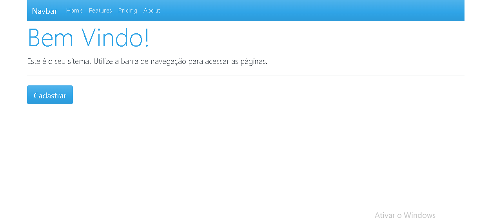

   

# React Basic Crud

> Basic product registration using React
>  

---

# :pushpin: Table of Contents

- [Features](#rocket-features)
- [Installation](#construction_worker-installation)
- [Getting Started](#runner-getting-started)
- [FAQ](#postbox-faq)
- [Found a bug? Missing a specific feature?](#bug-issues)
- [Contributing](#tada-contributing)
- [License](#closed_book-license)

# :rocket: Features

- Register product
- Delete product
- Edit product

**Obs: Some functions are not implemented yet**

# :construction_worker: Installation

**You need to install [Node.js](https://nodejs.org/en/download/) and [Yarn](https://yarnpkg.com/) first, then in order to clone the project via HTTPS, run this command:**

`git clone https://github.com/MayaraViana/react-crud.git`
SSH URLs provide access to a Git repository via SSH, a secure protocol. If you have a SSH key registered in your Github account, clone the project using this command:
`git clone git@github.com:MayaraViana/react-crud.git`
**Install dependencies**
`yarn install`
**Running the project**
`yarn start`

# :postbox: Tecnologies I used

**What are the technologies used in this project?**
The tecnologies used in this project are [NodeJS](https://nodejs.org/en/) + [React.js](https://pt-br.reactjs.org/) to develop amazing views & [SCSS](https://sass-lang.com/documentation/syntax) to handle the styles architecture and a better maintenance than normal CSS.

# :bug: Issues

Feel free to **file a new issue** with a respective title and description on the the [React-crud](https://github.com/MayaraViana/react-crud/issues) repository. If you already found a solution to your problem, **i would love to review your pull request**!

# :closed_book: License

Released in 2020.
This project is under the [MIT license](https://github.com/MayaraViana/react-crud/blob/master/LICENSE).
Made with love by [Mayara Viana](https://github.com/MayaraViana) 💜😄
